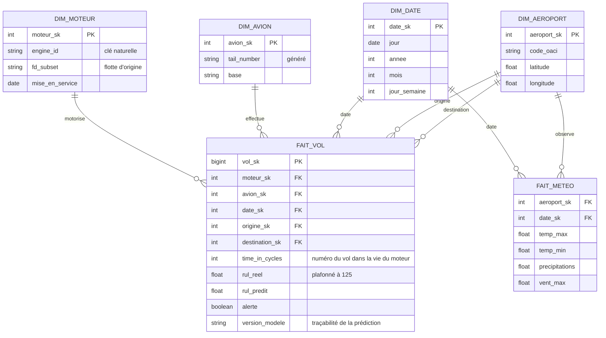

# Couche gold — spécification

**Statut : spécifiée, non implémentée** (ADR 0002).

Schéma en **constellation** : deux tables de faits partagent les
dimensions date et aéroport.

## Choix de modélisation

| choix | justification |
|---|---|
| **Grain de `FAIT_VOL` : un vol d'un moteur** | c'est le grain natif de C-MAPSS — un point agrégé par vol |
| **Clés de substitution** (`_sk`) | isolent le gold des identifiants sources, qui peuvent changer |
| **Aéroport en double rôle** : origine et destination | une seule dimension, deux relations — évite de dupliquer la table |
| **`FAIT_METEO` séparé**, au grain aéroport × jour | la météo n'a pas le grain du vol ; la fusionner dupliquerait chaque observation sur tous les vols du jour |
| **`version_modele` dans le fait** | répond à l'exigence de journalisation : retrouver quel modèle a prédit quoi (conformité, art. 12) |
| **Les SDR sont absents** | aucune clé commune avec la flotte simulée ; les rattacher serait inventer une jointure (README) |

## Questions auxquelles le gold répondrait

- Combien d'alertes par aéroport de base et par mois ?
- Les alertes sont-elles plus fréquentes après des journées de fortes
  précipitations ? *(sur données réelles uniquement — voir note de
  substitution)*
- Quelle version du modèle a émis chaque alerte d'un trimestre ?