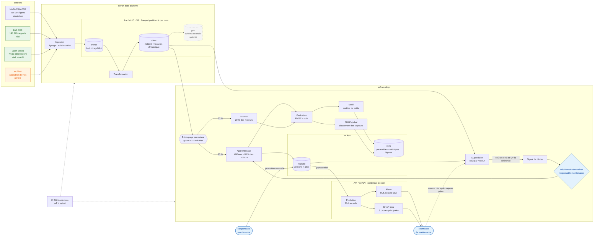
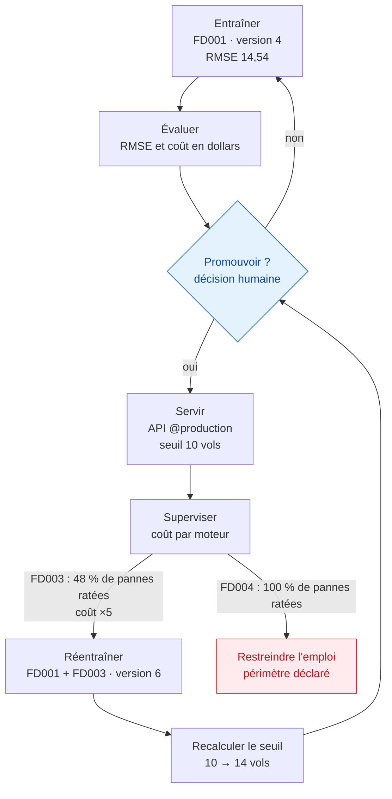

# Architecture — vue d'ensemble

## 1. Les composants

**Légende**

| couleur ou trait | signification |
|---|---|
| vert | source **réelle** |
| orange | donnée **générée** |
| bleu | **humain** : les points où une personne décide |
| gris, pointillés | **spécifié, non implémenté** |
| flèche en pointillés | lien **prévu** ou non bloquant |

**Cinq lectures à retenir**

- **Deux dépôts, une dépendance à sens unique** : `safran-mlops` lit le
  silver, il ne l'écrit jamais (ADR 0004).
- **Un découpage par moteur, jamais par ligne** : aucun moteur ne figure
  à la fois dans l'apprentissage et dans l'examen. Il n'y a **pas de
  jeu de validation dans cette version du projet** : le choix du modèle et du seuil ayant été effectué à partir de l'examen, les performances rapportées sont susceptibles d'être optimistes.
- **Deux SHAP, deux usages** : le SHAP global, calculé à
  l'entraînement, classe les capteurs et vérifie que le modèle s'appuie
  sur la physique ; le SHAP local, calculé par l'API à chaque requête,
  explique au technicien pourquoi *ce* moteur alerte.
- **Deux humains dans la boucle, trois décisions** : le responsable
  maintenance promeut et décide du réentraînement, le technicien décide
  de la dépose. La machine n'agit jamais seule (ADR 0004, MLOps).
- **Une boucle fermée, et son maillon manquant** : la supervision
  n'enclenche pas l'entraînement, elle **émet un signal de dérive**
  quand le coût dépasse 2× la référence ; c'est le responsable
  maintenance qui décide de réentraîner (ADR 0005, MLOps). La
  supervision a besoin du RUL réel, que seul le technicien constate
  après la dépose : ce retour terrain est prévu, pas encore outillé.

## 2. Le cycle de vie d'un modèle, tel qu'il a été vécu

Ce diagramme n'est pas théorique : **chaque nœud porte un chiffre
mesuré**. La branche rouge rappelle que tout ne se corrige pas par
réentraînement — une flotte jamais vue impose de restreindre l'emploi.